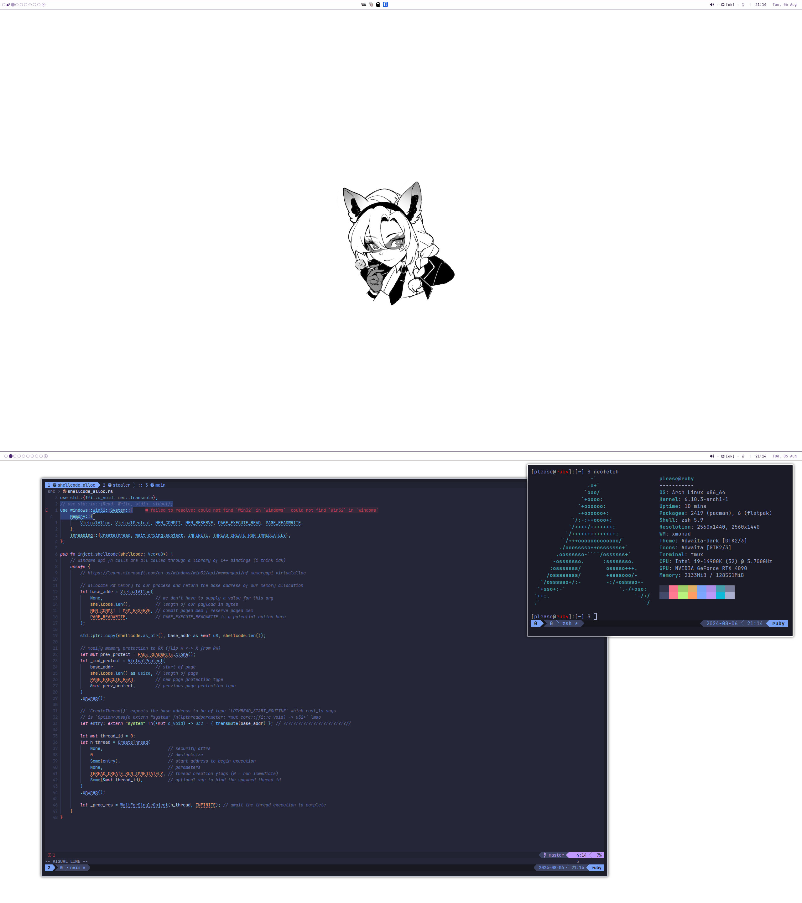

# xmonad dotfiles

h*skell

## dependencies

- xmonad + xmonad-contrib
- eww
- picom
- alacritty & tmux
- rofi
- neovim
- other misc stuff

> check `xmonad.hs`, `xmonad/scripts`, `eww/scripts` & `eww/variables.yuck` for a
slightly more exhaustive list.
