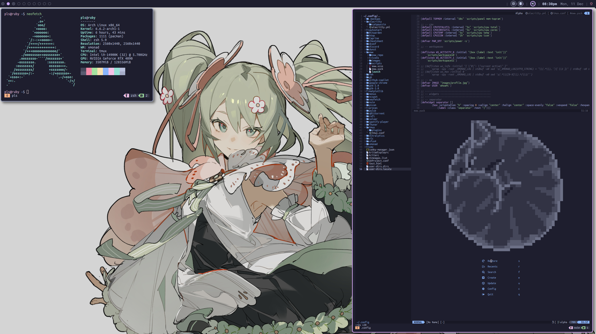

# dotfiles

h*skell

## deps

- [xmonad](https://github.com/xmonad/xmonad) & [xmonad-contrib](https://github.com/xmonad/xmonad-contrib)
- [eww](https://github.com/elkowar/eww)
- [alacritty](https://github.com/alacritty/alacritty)
- [tmux](https://github.com/tmux/tmux)

_optionally,_

- [picom](https://github.com/yshui/picom)
- [`zsh`](https://www.zsh.org/) & [omz](https://github.com/ohmyzsh/ohmyzsh)
